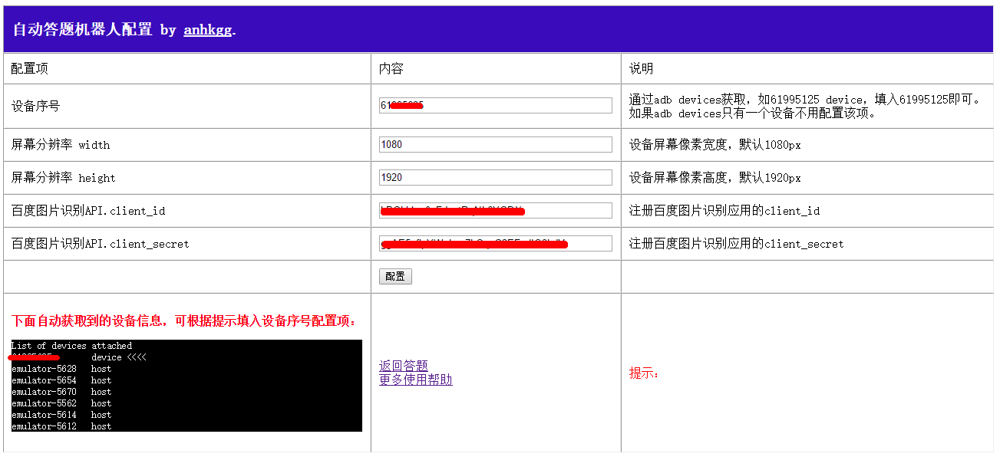
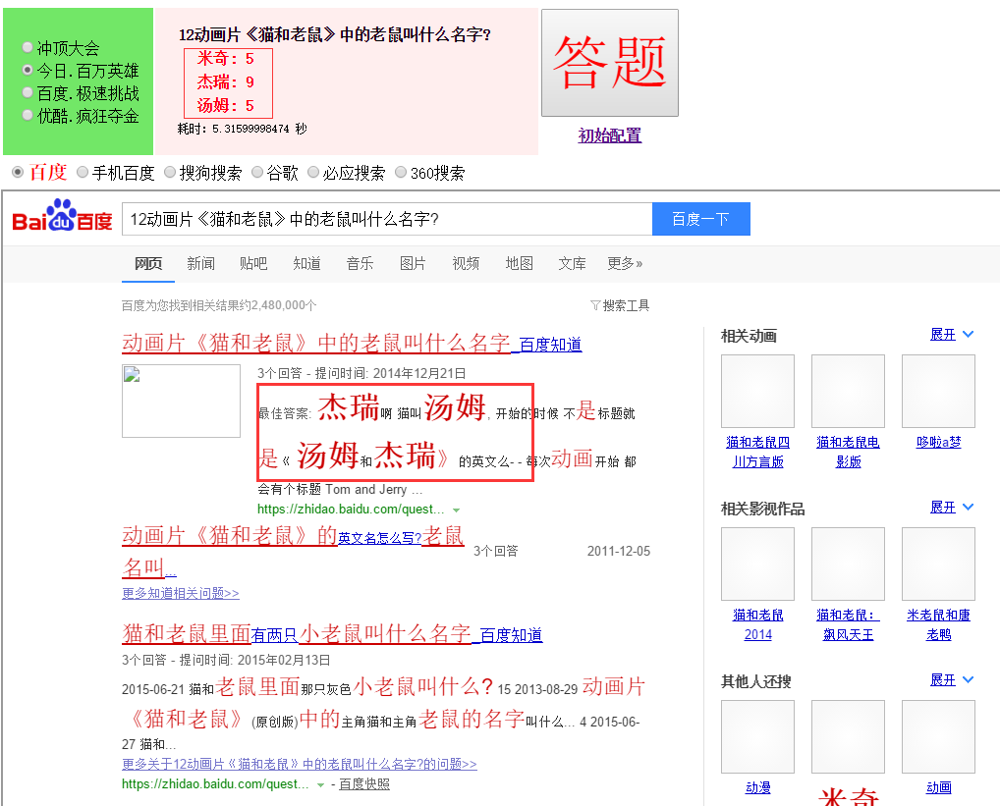
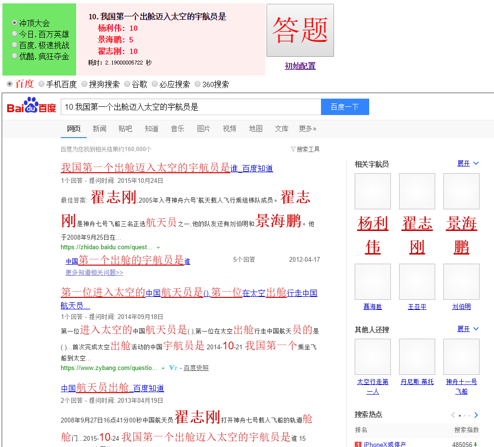
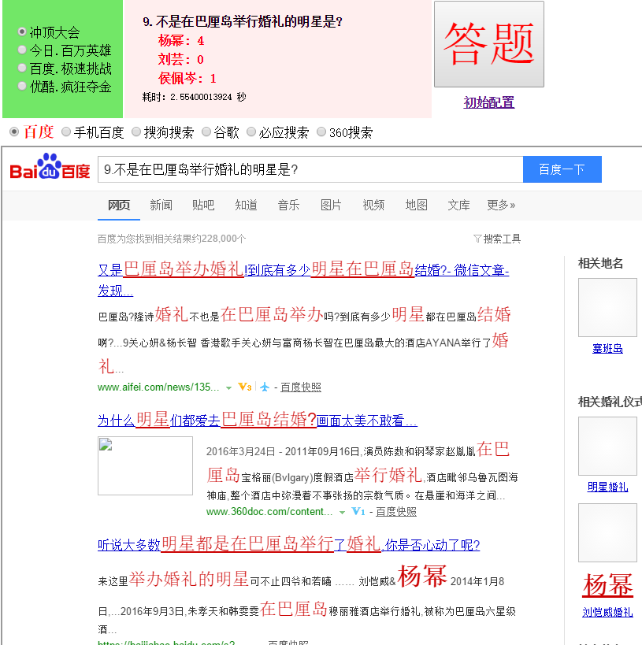
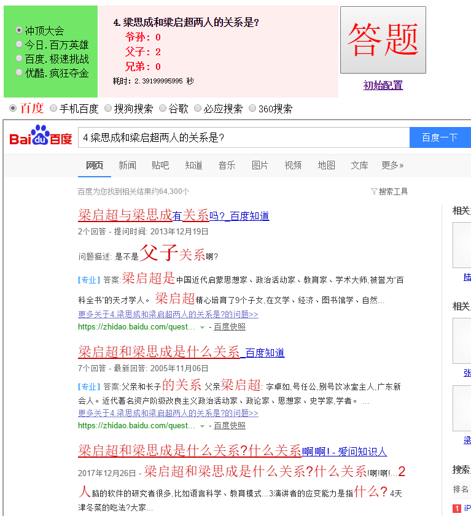

# 直播答题小能手

**声明**

<font color="red"><b>本项目是作者业余开发，仅为娱乐和研究的目的，如有任何人凭此做何非法事情，均于作者无关。</b></font>

**支持：**
1. 冲顶大会
2. 百万英雄（西瓜视频）
3. 极速挑战（好看视频）
4. 疯狂夺金（优酷）

**特性：**
1. 多平台自由切换选择
2. 多种搜索引擎选择（百度搜索，手机百度搜索，搜狗搜索，360搜索，必应搜索，谷歌搜索）
3. 答案匹配统计显示
4. 搜索结果页显示，匹配到的答案字体突出显示
5. 设备参数可配置，可视化获取设备信息
6. 一键获取答案

# 安装

1. 安装python2.7.14（安装中勾选环境变量配置，否则需要自己配置环境变量）

```
https://www.python.org/ftp/python/2.7.14/python-2.7.14.msi
```

2. 安装pip(`https://pypi.python.org/pypi/pip`)，解压后，进入目录，使用命令`python setup.py install`安装

```
https://pypi.python.org/packages/11/b6/abcb525026a4be042b486df43905d6893fb04f05aac21c32c638e939e447/pip-9.0.1.tar.gz#md5=35f01da33009719497f01a4ba69d63c9
```
3. pip安装django、PIL、simplejson

```
pip install django==1.11
pip install simplejson
```
下载安装PIL
```
http://effbot.org/downloads/PIL-1.1.7.win32-py2.7.exe
```

所需资源包地址：[https://pan.baidu.com/s/1ggE8Rth](https://pan.baidu.com/s/1ggE8Rth) 密码: `pq9p`

4. 使用百度文字识别API识别图片文字，申请百度开发者账号，创建文字识别应用，拿到client_id, client_secret

注册地址：
```
https://cloud.baidu.com/product/imagerecognition
```

登陆后，进入后台，点击左侧，产品服务->文字识别，创建应用即可。

```
https://login.bce.baidu.com/
```

然后管理应用中，找到client_id和client_secret


需要研究API的看这里
```
https://cloud.baidu.com/doc/IMAGERECOGNITION/ImageClassify-API.html#.E7.AE.80.E4.BB.8B
```

5. 手机通过USB连接到电脑，开启手机调试模式（某些手机需要手工确认允许），运行adb devices，拿到手机设备号，也可在系统配置页提取到，本系统已经在配置页中自动获取。

# 怎么答题

1. 下载源码，进入源码根目录，启动服务

```
c:\answerot\>python manage.py runserver 0.0.0.0:8000
Performing system checks...

System check identified no issues (0 silenced).

You have 13 unapplied migration(s). Your project may not work properly until you apply the migrations for app(s): admin, auth, contenttypes, sessions.
Run 'python manage.py migrate' to apply them.
January 23, 2018 - 00:21:22
Django version 1.11, using settings 'answerot.settings'
Starting development server at http://0.0.0.0:8008/
Quit the server with CTRL-BREAK.
```

2. 打开浏览器访问 localhost:8000

3. 第一次使用，先点击初始配置进入配置页，配置必要的参数，如图。左下角黑色区域为自动获取到的设备信息，手机设备一般对应xxxxx device，拿到xxxx填入对应配置项即可。虚拟机一般是emilator-xxxx，填入这串值即可。



4. 配置完成后，返回答题页，打开答题app，等待题目出现，同时浏览器页面中答题按钮，大约2秒左右出现答案

5. 确认答案。某些时候搜索引擎的答案肯定不是很准的，所需需要自己浏览结果页，寻找答案，由于选项相关文字都突出显示，可以快速查找答案。

```
答案1：数量1
答案2：数量2
答案3：数量3
```

有以下几种情况：
1. 答案数量只有某一个有值，其他都是0，则很大可能这个就是正确答案
2. 每个答案都有数量，需要自己浏览结果页找到正确答案
3. 某些题目是否定意义，也就是问’不‘，’没有‘等，则取数量是0的答案
4. 由于受图片质量以及百度识图能力的影响，某些时候可能影响识图结果，需要注意

**注意**

1. 保持手机屏幕常量，否则截图失败
2. error: device offline, 重新插拔手机
3. 如果adb devices没有设备，确认手机打开usb调试模式，并且允许电脑调试

# 效果截图









# 捐助

如果觉得本项目对你有帮助，可以给作者发点小红包表示鼓励。

